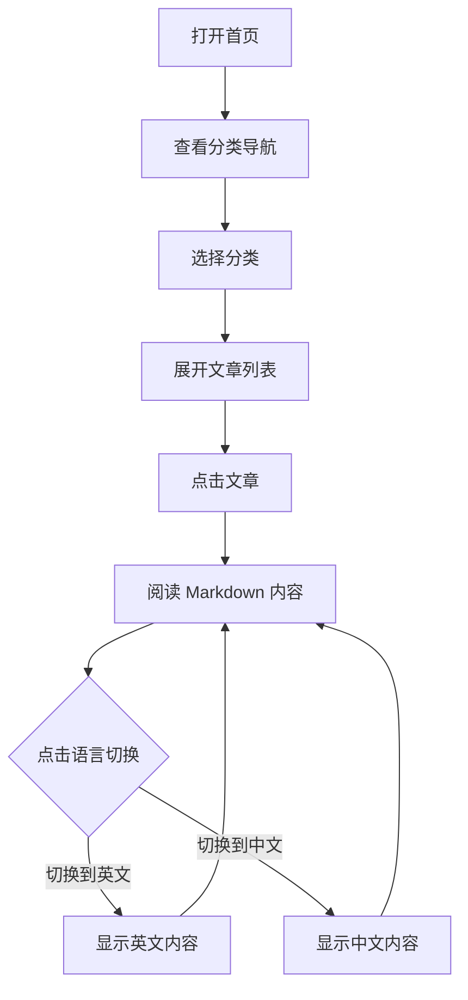

## 1. 产品概述

一个双语文档阅读器，将 JS 面试知识库的 Markdown 文件以结构化、可切换语言的方式呈现。

- 核心功能：浏览 37 篇 JS 面试题，支持一键中英文切换
- 目标用户：准备前端面试的中英文开发者
- 价值：解决 GitHub Issues 散乱难检索的问题，提供沉浸式双语阅读体验

## 2. 核心功能

### 2.1 功能模块

1. **首页导航**：按分类展示所有题目（5 个分类 + 37 篇文章）
2. **文章阅读页**：渲染 Markdown 内容，代码高亮
3. **中英切换**：一键切换界面语言和内容语言
4. **分类筛选**：按 JS 基础 / ES6+ / 手写实现 / 数组对象 / DOM 浏览器 切换

### 2.2 页面详情

| 页面 | 模块 | 功能说明 |
|------|------|----------|
| 首页 | 分类导航 | 5 个分类卡片，展示分类名称(中英)和文章数量 |
| 首页 | 文章列表 | 每篇文章显示中英文标题 |
| 文章页 | Markdown 渲染 | 渲染代码块、表格、列表，代码高亮 |
| 文章页 | 语言切换按钮 | 顶部按钮切换 CN / EN，切换后内容、导航文字同步切换 |
| 全局 | 顶部导航栏 | 返回首页、当前分类路径、语言切换 |

## 3. 核心流程

用户打开页面 → 看到分类导航 → 选择一个分类 → 展开文章列表 → 点击文章 → 阅读内容 → 点击语言切换按钮 → 内容切换为中/英文



## 4. 用户界面设计

### 4.1 设计风格

- **整体调性**：极简主义 + 学术风格，干净、留白充足，适合长时间阅读
- **主色调**：深色导航栏 (#1a1a2e)，白色背景 (#fafafa)，强调色为暖橙色 (#ff6b35)
- **字体**：
  - 中文：思源黑体 / system-ui
  - 英文：Inter 或 JetBrains Mono（代码）
- **按钮风格**：圆角胶囊形状，语言切换按钮有滑移动画
- **布局**：左侧窄导航栏（文章列表），右侧主内容区
- **代码块**：深色主题，圆角，行号

### 4.2 页面设计概览

| 页面 | 模块 | UI 元素 |
|------|------|----------|
| 首页 | Hero 区域 | 大标题 "JS 面试知识库"（中英双语）, 副标题, 统计(37篇文章/5个分类) |
| 首页 | 分类卡片 | 5 个渐变色卡片，悬浮上移效果，每个卡片显示中英文分类名和文章数 |
| 首页 | 文章列表 | 两列网格布局，每篇显示编号、中文标题、英文标题 |
| 文章页 | 内容区 | Markdown 渲染，代码块深色背景 + 语法高亮 |
| 文章页 | 语言切换 | 固定在右上角的胶囊按钮，CN / EN 滑动切换 |
| 全局 | 顶部导航 | 固定顶部，左侧 Logo，右侧语言切换按钮 |

### 4.3 响应式

- 桌面优先设计
- 平板：左侧导航收缩为汉堡菜单
- 手机：全屏单列布局

## 5. 内容结构

文章使用 YAML front matter 区分中英文内容：

```yaml
---
title:
  zh: 作用域与变量提升
  en: Scope & Hoisting
category:
  zh: JS 基础
  en: JS Fundamentals
---
```

Markdown 主体中，使用 `<!-- zh -->` 和 `<!-- en -->` 注释标签包裹不同语言的内容。
代码块共用，不需要重复。