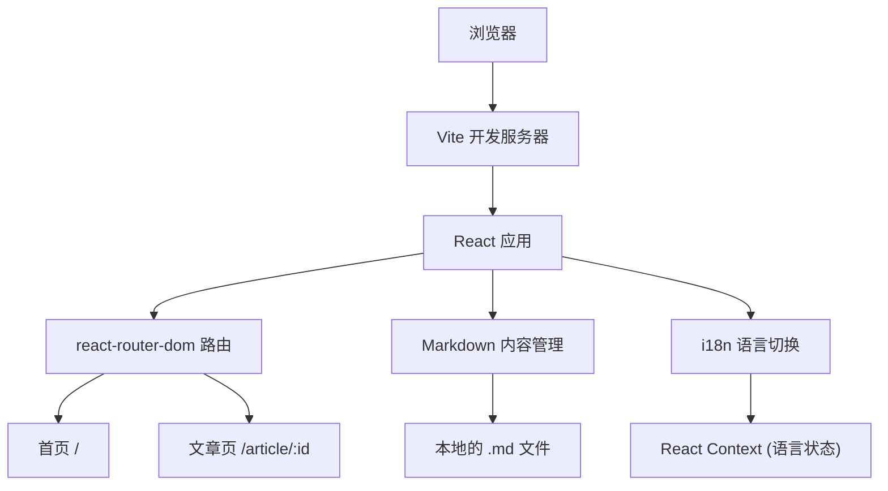

## 1. 架构设计

纯前端单页应用，无后端依赖。通过前端路由加载不同文章内容。



## 2. 技术选型

- **前端框架**：React 18 + TypeScript
- **构建工具**：Vite
- **路由**：react-router-dom v6
- **Markdown 渲染**：react-markdown + remark-gfm（支持表格等 GFM 语法）
- **代码高亮**：react-syntax-highlighter
- **样式方案**：Tailwind CSS v3
- **内容管理**：每个文章一个 .md 文件，通过 `import.meta.glob` 批量加载
- **语言切换**：React Context + useReducer，全局状态管理

## 3. 路由定义

| 路由 | 说明 |
|------|------|
| / | 首页：分类导航 + 文章列表 |
| /article/:id | 文章阅读页，:id 对应文章编号 (01-37) |

## 4. 组件树

```
App
├── Layout (全局布局)
│   ├── Navbar (顶部导航栏 + 语言切换按钮)
│   └── Content
│       ├── HomePage (首页)
│       │   ├── HeroSection (标题区域)
│       │   ├── CategoryGrid (分类卡片)
│       │   └── ArticleList (文章列表)
│       └── ArticlePage (文章页)
│           ├── ArticleHeader (文章标题 + 导航面包屑)
│           ├── MarkdownRenderer (内容渲染)
│           └── LanguageToggle (语言切换)
```

## 5. 数据模型

### 5.1 文章元数据

```typescript
interface ArticleMeta {
  id: string;
  title: { zh: string; en: string };
  category: { zh: string; en: string };
  categoryId: string;
  order: number;
}

interface Article {
  meta: ArticleMeta;
  contentZh: string;  // 中文 Markdown 内容
  contentEn: string;  // 英文 Markdown 内容
}
```

### 5.2 分类定义

```typescript
interface Category {
  id: string;
  name: { zh: string; en: string };
  articles: ArticleMeta[];
}
```

## 6. 文章内容格式

每个 .md 文件使用 front matter + 语言标记：

```markdown
---
title_zh: 作用域与变量提升
title_en: Scope & Hoisting
category: 01-js-basics
order: 1
---

<!-- zh -->
## 作用域

当函数执行的时候...
<!-- en -->
## Scope

When a function executes...
```

## 7. 语言切换机制

- 语言状态保存在 React Context 中
- 可选值: `'zh' | 'en'`
- 切换时所有文本组件重新渲染
- 导航、分类名、按钮文字、文章内容全部跟随当前语言
- 语言偏好存储到 `localStorage`，刷新后保持